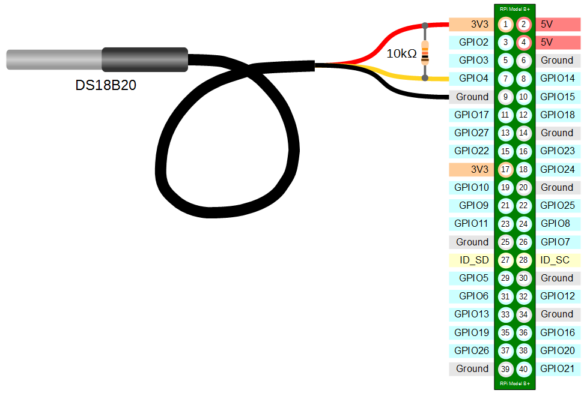

# help
Help page for the project

## Useful Linux Commands 

### Server 
* `ps -la` list all running processes. 
* `sudo lsof -i :X` lists processes running on port X. 
* `sudo kill -9 X` kills process with PID of X.
* `sudo python3 X.py &` runs X.py in the background. 
* `sudo ufw allow X/tcp` allow TCP connections to port X.

### Device 
The device is a Raspberry Pi Zero W.  

#### WiFi
  
* `sudo nano /etc/wpa_supplicant/wpa_supplicant.conf` opens the file where WiFi can be configured. 

```
#Example of wpa_supplicant.conf file
country=GB
ctrl_interface=DIR=/var/run/wpa_supplicant GROUP=netdev
update_config=1

network={
        ssid="WiFi-SSID"
        psk="WIFI-Password"
}
```
* `sudo wpa_cli -i wlan0 reconfigure` restarts wlan0.
* `ifconfig wlan0` to ensure wlan0 has an IP address.
* `curl http://www.google.com` again, to ensure there is internet access.

#### GPIO

    
  
* `sudo crontab -e` allows you to run code on start-up.  
```
#This will run script.sh on boot in the background
@reboot sudo ./script.sh & 
```
* `lsmod` shows mods that are running. 
* `sudo modprobe w1-therm/w1-gpio` activates the mod you want. 

## Setting Up The Device
What you'll need:  
* Raspberry Pi Zero W.
* Micro-SD card (4GB or greater. 8GB recommended). 
* USB to micro-USB cable. 
* Micro-SD to SD card/USB adapter (or any method of reading and writing to a Micro-SD using a PC).
* A PC to load the OS onto the Micro-SD. We used a Windows PC.

### Installing the OS
Instructions on how to install an OS and SSH into the Raspberry Pi Zero W.
* Download a lite version of [Rasbian](https://www.raspberrypi.org/downloads/raspbian/). The lite version does not have a GUI, which is ideal for this project. 
* Format the Micro-SD card after plugging it into the PC.
* Use [Etcher](https://etcher.io/) to write the Raspbian Image to the Micro-SD card.
* Open the Micro-SD card folder after writing the Raspbian Image and do the following:  
  1. Open `config.txt` and enter the following at the bottom of the file: `dtoverlay=dwc2`.  
  2. Open `cmdline.txt` and enter the following **in between "rootwait" and "quiet"**: `modules-load=dwc2,g_ether`. 
  3. Create a new file in the root of the Micro-SD card (i.e. same level as the previous two files) called `ssh`. *Notice: there is no file extension to this file!*
* After this, safely eject the Micro-SD card and plug it into the Raspberry Pi Zero.   
* Plug in the Micro-USB cable to the **USB** port of the Raspberry Pi Zero W. **This is next to the identical looking port called PWR IN.** 

### SSH over USB
* Plug the other side to the PC and the light on the Pi should turn on/start flashing. Do **NOT** unplug the device until its driver is installed as a "*USB Ethernet/RNDIS Gadget*" on the computer. This is important in the first boot as the files can become corrupted!
* When the device appears with the name above as one of the PC's networks adapters, you can attempt to SSH. 
* In some cases, you may have to download [Bonjour](https://support.apple.com/kb/DL999). This would be clear if the device shows up as an adapter but attempting to SSH causes a "Host does not exist" error. 
* Finally, use a program like [PuTTY](https://www.putty.org/) to SSH.
  1. Host: `raspberrypi.local`
  2. Username: `pi`
  3. Password: `raspberry`
* If you have a command line version of SSH installed, you can do something like: `ssh pi@raspberrypi.local` and enter the password. 
  
